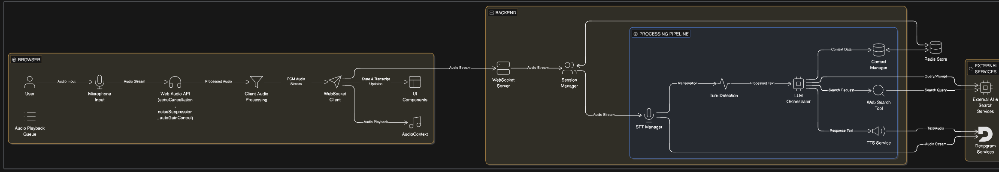

# Production Voice Agent (Node.js + Audio Cascade)
## Setup Instructions

### Prerequisites

- **Node.js**: v18+ (tested on Node 18.x)
- **npm**: v9+
- **Redis**: v7+ (used for session persistence and conversation memory)
- **Browser**: Chrome or Edge (Web Audio API required)
- **Operating System**: Tested on macOS (should work on Linux; Windows not tested)

**Optional**
- Docker (recommended for running Redis in production or cloud environments)

---

### Installation Steps

Clone the repository:

```bash
git clone <your-repo-url>
cd voice-agent
```

Install backend dependencies:

```bash
cd backend
npm install
```
The frontend is built using plain HTML, CSS, and JavaScript (no framework or build step required):
```bash
cd ../frontend
```
---
### How to Run Locally

Start Redis (only if persistence is required):

```bash
redis-server
```

Start the backend server:

```bash
cd backend
node src/server.js
```

Run the frontend:

- Open `frontend/index.html` directly in Chrome or Edge
- Allow microphone access when prompted
- Start speaking to the voice agent

The backend will run on port `3001` by default.

### Architecture Overview


This system is built as a real-time cascaded voice pipeline where each stage has a single, clearly defined responsibility. Audio is captured in the browser using the Web Audio API with basic echo cancellation and noise suppression enabled, then streamed to the backend over WebSockets for low-latency processing.

On the backend, every client connection is treated as an isolated session. Incoming audio first passes through a custom Voice Activity Detection (VAD) layer with adaptive thresholds, which identifies speech start, speech end, and turn boundaries. Once a turn is finalized, audio is forwarded to the Speech-to-Text (STT) manager, and the resulting transcript becomes the source of truth for the rest of the pipeline.

The transcribed text is routed through the LLM orchestration layer, where intent is identified and tools such as web search are conditionally invoked if required. The final response is split into sentence-sized chunks and sent to the Text-to-Speech (TTS) service. Each sentence is synthesized as a fully buffered WAV file to prioritize stability and audio correctness.

On the frontend, audio segments are played sequentially using a single AudioContext. Playback is strictly ordered, and barge-in is handled by immediately stopping the active audio source and clearing the queue when user speech is detected again.

Multi-user support is achieved through strict session isolation and lightweight per-session state management. Conversation context and metadata can be persisted in Redis, allowing sessions to survive reconnects and enabling future horizontal scaling. Context updates can be injected into an active session at runtime, and all subsequent turns immediately reflect the updated context without restarting the pipeline.


## Design Decisions

- **Speech-to-Text (Deepgram)**  
  I chose Deepgram mainly because it offers reliable real-time streaming with predictable endpointing behavior. While testing different STT providers, I noticed that small inconsistencies in partial transcripts or end-of-speech detection had a huge impact on the overall conversation flow. Deepgram felt stable enough to build custom VAD and turn-detection logic on top of, which mattered more to me than marginal accuracy gains.

- **Language Model (Groq)**  
  Groq stood out because of how fast it responds. In a voice-based system, the silence between the user finishing a sentence and the assistant reacting is immediately noticeable. Groq’s low time-to-first-token made conversations feel responsive without needing aggressive streaming tricks, which aligned well with the reliability-first approach I eventually adopted.

- **Text-to-Speech Strategy (Buffered WAV per Sentence)**  
  I initially experimented with streaming MP3, WAV, and even raw PCM audio to minimize latency. In practice, this caused frequent issues when combined with web search or slower LLM responses. After multiple failures, I switched to generating fully buffered WAV audio per sentence. This decision significantly improved audio stability and removed mid-speech cutoffs, even though it slightly increased overall latency.

- **Real-Time Communication (WebSockets)**  
  WebSockets were used throughout the system because the application requires continuous, bidirectional communication. They allow audio streaming, control signals (barge-in, stop, context updates), and transcript updates to happen over a single persistent connection without reconnecting or blocking other parts of the pipeline.

- **State-Based Flow Instead of Flags**  
  Early versions relied on simple flags like `isSpeaking` or `isListening`, which quickly became error-prone as features like barge-in and web search were added. Refactoring the system into a clear state-driven flow made the behavior easier to reason about and eliminated many race conditions that appeared under real usage.

---

## Performance Analysis

- **Latency Characteristics**  
  The system consistently achieves low time-to-first-token from the LLM (typically under 150ms) and completes full conversational turns within a few seconds, depending on response length. While it is not aggressively optimized for the absolute lowest latency, it feels responsive and consistent during real conversations.

- **Observed Bottlenecks**  
  The biggest performance challenges appeared when web search was introduced. External API calls introduced unavoidable delays, which conflicted with earlier streaming-based audio assumptions and resulted in awkward silence or partially spoken responses.

- **How Bottlenecks Were Addressed**  
  I restructured the pipeline so that “thinking” and “speaking” are clearly separated. Audio playback only begins once all required data is ready. This removed unpredictable pauses and made latency easier to measure and reason about.

- **Instrumentation and Debugging**  
  Every turn logs structured timing information for STT, LLM, TTS, and total latency. This made it possible to debug real issues using data rather than intuition, and helped guide architectural decisions instead of guessing.

---

## Scalability Considerations

- **Concurrent Sessions**  
  Each user connection is treated as a fully isolated session with its own state, transcript history, and audio streams. There is no shared mutable state between users, which prevents context bleed and makes concurrent usage safe.

- **Event-Driven Backend Design**  
  The backend is primarily IO-bound and uses Node.js’s event loop efficiently. Since no heavy processes are spawned per user, the system can handle many concurrent sessions without significant overhead.

- **Scaling Beyond a Single Instance**  
  For larger scale, the system can be horizontally scaled by running multiple backend instances behind a load balancer. Redis is already integrated for session persistence, which would allow sessions to survive reconnects across instances.

- **Efficiency Tradeoffs**  
  The choice to buffer audio and avoid aggressive streaming slightly increases latency but reduces retries, errors, and wasted computation, resulting in more predictable resource usage overall.

---

## Tradeoffs & Future Work

- **What I Optimized For**  
  I prioritized correctness, stability, and conversational clarity over raw speed. A slightly slower response that completes cleanly felt far more natural than fast but glitchy audio.

- **What I Intentionally Avoided**  
  Ultra-aggressive streaming and partial audio decoding were deliberately removed after causing repeated failures. While technically impressive, they made the system fragile and difficult to debug.

- **Current Limitations**  
  Noise suppression is still minimal and mostly handled on the client side. Turn detection relies on silence rather than semantic understanding, and provider fallback is architecturally present but not fully implemented.

- **Next Improvements**  
  With more time, I would add semantic turn completion checks, stronger server-side noise filtering, proper multi-provider STT fallback, and caching for repeated queries to reduce unnecessary LLM calls.

---

## Engineering Journey (Brief)

This project started as a straightforward voice pipeline and slowly evolved into a lesson in system design. Each new feature—especially web search—forced me to rethink earlier assumptions about streaming, latency, and control flow. Several iterations failed in subtle ways before I shifted from a “stream everything as fast as possible” mindset to one focused on predictability and state control. Most of the current architecture exists because earlier versions broke under real usage, and each failure helped shape a more stable and understandable system.